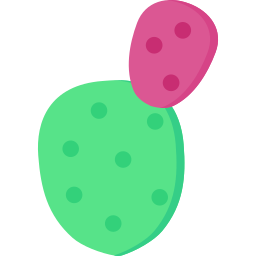
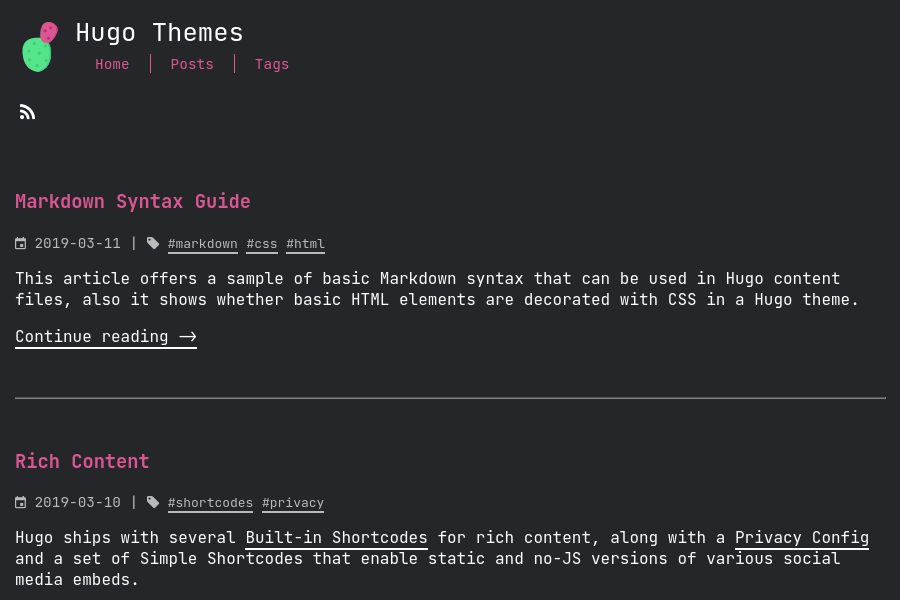

# Ficurinia

A prickly blog theme for Hugo



# [Demo](https://gabmus.org)

[Code for the demo website](https://gitlab.com/gabmus/gabmus.gitlab.io) (really my personal website)

[Screenshot gallery](https://gabmus.gitlab.io/hugo-ficurinia-screenshots/) showcasing 256 of the possible configurations that Ficurinia offers.

# Customization

## Configuration

These are some parameters you can use in your `config.toml` to customize Ficurinia:

```toml
baseURL = "https://example.com/"
theme = "hugo-ficurinia"
title = "My nice blog"
languageCode = "en"
defaultContentLanguage = "en"

# this will be included in the footer after the current year the site is last
# built, followed by the (c) symbol
# you can use markdown inside this field
copyright = "Some copyright notice - [my license](https://example.com/license)"

paginate = 5  # number of articles per page in the index
summaryLength = 70  # number of words for article summaries


[params]
    author = "Gabriele Musco"
    description = "A description for my website"  # this will be added as metadata

    posts = "posts"  # content directory where to find home page posts; default searches in "posts" and "post"
    showPostsLink = true  # show or hide the link to the simple post list
    extraContentDirs = []  # other content directories to render similarly to the home page
    showcaseDir = "showcase"  # create a content directory that shows a special showcase section in the home page

    # shows a specified single page as a home page, instead of the traditional articles list
    # requires setting `homeSinglePage`
    # goes well with extraContentDirs
    showSinglePageAsHome = false
    homeSinglePage = "/home"

    # It's best to put these icons in the "static" folder of your site
    logo = "/logo.svg"
    favicon = "/favicon.png"  # 32x32
    faviconIco = "/favicon.ico"  # 32x32
    appletouch = "/apple-touch-icon.png"  # 180x180
    svgicon = "/logo.svg"
    icon512 = "/icon512.png"  # 512x512 png image

    logoRightOfTitle = false  # positions the logo to the right of the title; default: false

    showTags = true  # show the Tags menu item; default true
    showRss = true  # show the link for the RSS feed; default true

    imageInArticlePreview = false  # show images in article preview; default false
    fitImageInArticlePreview = false  # make article preview images fit the article preview instead of getting cropped
    articleSummary = true  # show a summary in article preview; default true
    
    fontFamily = "JetBrains Mono"  # changes the font, default "JetBrains Mono"
    titleFontFamily = "JetBrains Mono"  # font used for titles and headings
    monospaceFontFamily = "JetBrains Mono"  # changes the monospace font for code, default "JetBrains Mono"

    # multipliers applied to font sizes, useful for custom fonts that may be too big or too small
    titleFontSizeMultiplier = 1.0
    mainFontSizeMultiplier = 1.0
    monoFontSizeMultiplier = 1.0

    contentWidth = "1000px"  # maximum width of the site content, css syntax

    paperCards = false  # enable paper card style; default false
    buttonTags = false  # enable button tag style; default false
    tagsInArticlePreview = true  # enable tags list in the article preview card
    gridView = false  # show post list as a grid. goes well with paperCards
    bigArticleTitle = false  # makes the title in the single article view bigger
    navtype = "standard"  # changes the style of the pagination, available styles are: "standard", "circles"
    enableShadow = false  # shows a shadow around some elements
    menuStyle = "standard"  # changes the style of the main site navigation menu, available styles are: "standard", "buttons"
    inputStyle = "standard" # changes the style of inputs (like the searchbar), available styles are: "standard", "buttons"

    enableSearch = true  # enable search page
    searchbarEverywhere = true  # if the searchbar should be shown in every page; requires enableSearch
    searchMenuLink = false  # add a search link to the navigation menu; requires enableSearch
    mobileHamburgerNav = false  # alternative hamburger menu layout for the main nav menu when screen is small

    enableFeatured = false  # enable a particular view for articles marked as featured (featured: true in the article frontmatter)

    underlineTitleLinks = false  # show an underline also for links that are titles

    # enable comments support with commento using the script from your server
    commento = "https://example.com/js/commento.js"

    # enable comments support with cactus comments (cactus.chat)
    cactusCommentsSiteName = "example.com"
    cactusCommentsServerName = "cactus.chat"
    cactusCommentsHomeserver = "https://matrix.cactus.chat:8448"

    # enable analytics using Plausible
    plausibleScriptUrl = "https://something.com/..."
    plausibleDomain = "example.com"

    # enable analytics using Umami
    umamiScriptUrl = "https://something.com/..."
    umamiWebsiteId = "example-tracking-code"

    enableShareOnFediverse = false  # enable a button at the end of an article to share it on the fediverse
    tocBeforeImage = false  # show the table of contents before the main article image; default false

    # WARNING: deprecated! Use [[menu.icons]] instead, look below
    # links = [
    #     ["GitLab", "https://gitlab.com/gabmus"],
    #     ["GNOME", "https://gitlab.gnome.org/gabmus"],
    #     ["YouTube", "https://youtube.com/TechPillsNet"]
    # ]

    # you can customize all of the colors in this theme
    # Colors are defined in data/colors.yml

    # alternative sidebar layout
    enableSidebarLayout = false
    tocInSidebar = false  # if the sidebar is enbabled, show the TOC in the sidebar

    # redirect to baseURL if current URL host doesn't match
    # useful if deploying in gitlab pages with custom domain and don't want
    # the username.gitlab.io/website url to persist
    # this requires you to set baseURL (see above)
    forceRedirect = false

    infiniteScrolling = false  # activates infinite scrolling instead of regular pagination
    enableFooterColumns = false  # activates footer columns, as described below
    enableJumbotron = false  # enables jumbotron, as described below
    # related articles will be selected randomly based on tags and shown at
    # the bottom of the article, after the comments
    enableRelatedArticles = false
    relatedArticlesNum = 2  # how many related articles to show
    randomRelated = false  # sorts related articles in random order (randomized at built time)

[menu]
    # these links will be added to the main navigation menu, sorted by weight
    # other elements in this menu are added automatically from the "pages" folder
    # the folder it will look into can be customized with the pages variable
    # in params above
    [[menu.main]]
        identifier = "about"
        name = "About"
        url = "/about/"
        weight = 10
    # these links (menu.icons) will be added as icon links below the main nav
    [[menu.icons]]
        identifier = "gitlab"
        name = "GitLab"
        url = "https://gitlab.com/gabmus"
        weight = 10
    [[menu.icons]]
        identifier = "gnome"
        name = "GNOME GitLab"
        url = "https://gitlab.gnome.org/gabmus"
        weight = 20

# this section is necessary if you want infinite scrolling
# it allows to output the article list as paged JSON so that "pages" can be retrieved via javascript
[outputs]
    home = ["HTML", "JSON"]
```

### Supported icons

For the `[[menu.icons]]` menu. They match identifier, name and url can be whatever. Here's a list of supported identifiers:

- discord
- email
- facebook
- github
- gitlab
- gnome
- instagram
- linkedin
- mastodon
- matrix
- peertube
- phone
- pleroma
- rss
- steam
- telegram
- twitter
- xmpp
- youtube

## Colors

Colors are completely customizable. They are defined in [`data/colors.yml`](data/colors.yml). Just copy that file over to `yoursite/data/colors.yml` and customize it to your liking.

## Footer columns

You can add various columns of links in the footer using the `data/footer_columns.yml` file.

Following is an example configuration:

```yaml
- title: My other projects
  links:
    - title: HydraPaper
      link: https://hydrapaper.gabmus.org
    - title: Ada UI
      link: https://gitlab.com/gabmus/ada-ui
- title: About me
  links:
    - title: My personal website
      link: https://gabmus.org
    - title: My GitLab
      link: https://gitlab.com/gabmus
    - title: My GNOME GitLab
      link: https://gitlab.gnome.org/gabmus
```

## Jumbotron

You can add a jumbotron at the beginning of the home page using the `data/jumbotron.yml` file.

Following is an example configuration:

```yaml
title: My awesome website
hugeTitle: false
subtitle: Some fancy subtitle
image: /jumbotron_image.svg
imagePosition: left  # values: left, right, top, bottom
background: /img/jumbotron_bg.png
backgroundVideo: /jumbotron_video.mp4  # will replace the background image
# it's best to provide both an mp4 and a web source for the video for better compatibility
backgroundVideoMp4: /jumbotron_video.mp4
backgroundVideoWebm: /jumbotron_video.webm
videoOpacity: 1.0
textShadow: false
fullscreen: false
downArrow: false
whiteText: false  # force white text in the jumbotron
links:
  - title: About me
    link: /pages/about
  - title: Read my blog
    link: /posts
```

# Post parameters

Every post can have various parameters in the frontmatter, here are some that you may find useful

- `title`: the title of the article
- `date`: usually automatically populated, holds the date and time of the post creation
- `description`: a brief description of the post, useful for SEO optimization
- `tags`: an array of tags, useful for searching similar articles
- `image`: a link to a feature image for the article, shown in the preview as well
- `alt`: alternative text to be shown if image is not available or fails to download
- `imageCaption`: a markdown text rendered as a caption for the article image described above
- `featured`: boolean, indicate if the post should be shown as featured
- `comments`: boolean, if true it enables comments for the current post, if false it disables them (default is true)
- `showDate`: boolean, true by default, if false hides the date. Useful for non-article pages where the date isn't important
- `showTitle`: boolean, true by default, if false hides the title.
- `showShare`: boolean, true by default, if false hides the share button.
- `norss`: boolean, if set to true the page will be skipped in the rss feed
- `nosearch`: boolean, if set to true the page won't show up in searches
- `toc`: boolean, if set to true a table of contents will be shown for the article

## Table of contents settings

You can tweak the TOC settings in your `config.toml`:

```toml
[markup]
  [markup.tableOfContents]
    endLevel = 5
    ordered = false
    startLevel = 1
```

# Generate icons

It's best to use the provided `generate_icons.sh` script to generate all necessary icons for your website. This script requires ImageMagick, that you will need to install separately.

For the best results, place your logo in svg format inside the `static` directory of your website, rename it to `logo.svg` and then call `./themes/hugo-ficurinia/generate_icons.sh static/logo.svg`.

The script will take care of generating all the icons you need.

Finally, make sure to edit your config.toml to include the following:

```toml
# ...
[params]
    logo = "/logo.svg"
    logoAltText = "Logo"
    favicon = "/favicon.png"
    faviconIco = "/favicon.ico"
    appletouch = "/apple-touch-icon.png"
    svgicon = "/logo.svg"
    # ...
```

# Inject custom content

Ficurinia supports injecting custom content into the theme. There are several files you can create in `layouts/partials/inject` that will be included inside the theme in different places.

| Partial | Placement |
|---------|-----------|
| `layouts/partials/inject/body.html` | Before closing the `body` tag |
| `layouts/partials/inject/content-after.html` | After a post or page content |
| `layouts/partials/inject/content-before.html` | Before a post or page content |
| `layouts/partials/inject/footer.html` | At the beginning of the footer |
| `layouts/partials/inject/head.html` | Before closing the `head` tag |
| `layouts/partials/inject/header-after.html` | Before closing the header |
| `layouts/partials/inject/header-before.html` | At the beginning of the header |

# Does *Ficurinia* mean anything?

It's Sicilian for Indian fig, also known as prickly pear cactus.
